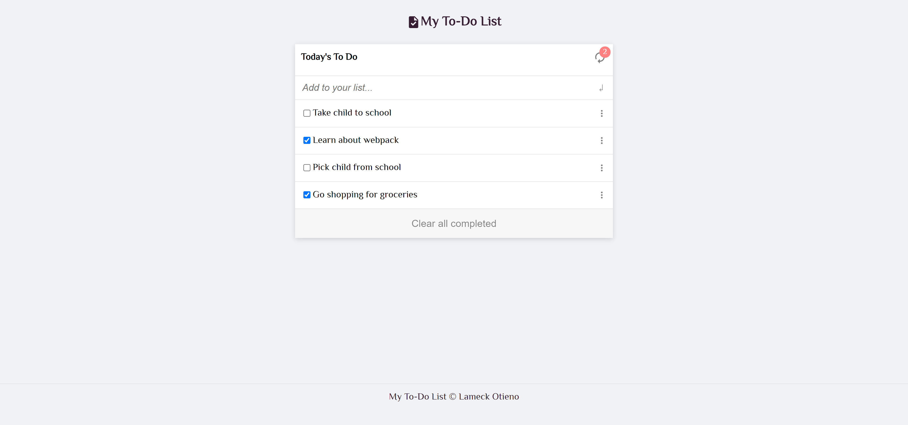

# To Do List

## Table of Contents

* [About the Project](#about-the-project)
* [Built With](#built-with)
* [Getting Started](#getting-started)
* [Contributing](#contributing)
* [Author](#author)
* [Acknowledgements](#acknowledgements)

## About Project

A simple TO-Do List built with Webpack. It allows user to add tasks to the list, remove tasks from the list, reposition tasks on the list and even delete task from the list.

I have attempeted to implement the MVC framework with this project as a learning undertaking. Thus, code has been separate into models, views, and controllers directories.



## [Live Demo](https://lameck1.github.io/todo-list/)

## Built With

* HTML5
* CSS
* Javascript
* Webpack

## Getting Started

* Clone this repo <https://github.com/Lameck1/todo-list>

    ```bash
    git clone https://github.com/Lameck1/todo-list.git
    ```

* Navigate to todo-list folder/directory

    ```bash
    cd todo-list
    ```

* On the comandline, at the project's root, run ```npm i``` to install app dependencies

* Next, run ```npm start``` which will build the project from ```src``` directory and serve into memory

* Go to ```http://localhost:9000/``` to interact with the app

* ALTERNATIVELY

  * Just run ```npm run build``` or ```npx webpack``` which will build the project and generate output files into the ```dist``` directory.

  * Go to ```dist``` directory and manually open ```index.html``` to interact with the app

## Contributing

Contributions, issues, and feature requests are welcome!

Feel free to check the [issues page](https://github.com/Lameck1/todo-list/issues)

  1. Fork the Project
  2. Create your Feature Branch (`git checkout -b feature/newFeature`)
  3. Commit your Changes (`git commit -m 'Add some newFeature'`)
  4. Push to the Branch (`git push -u origin feature/newFeature`)
  5. Open a Pull Request

## Author

👤 **Lameck Otieno**

* GitHub: [@githubhandle](https://github.com/Lameck1)
* Twitter: [@twitterhandle](https://twitter.com/lameck721)
* LinkedIn: [LinkedIn](https://www.linkedin.com/in/lameck-odhiambo-642b7077/)
* Portfolio: [Portfolio](https://lameck.me)

## Acknowledgements

Credits go to the following for providing guides on JavaScript

* [**MDN Web Docs**](https://developer.mozilla.org/en-US/docs/Learn/JavaScript/Objects)
* [Freecodecamp](https://www.freecodecamp.org/learn/javascript-algorithms-and-data-structures/)

## Show your support

Give a ⭐️ if you like this project!
